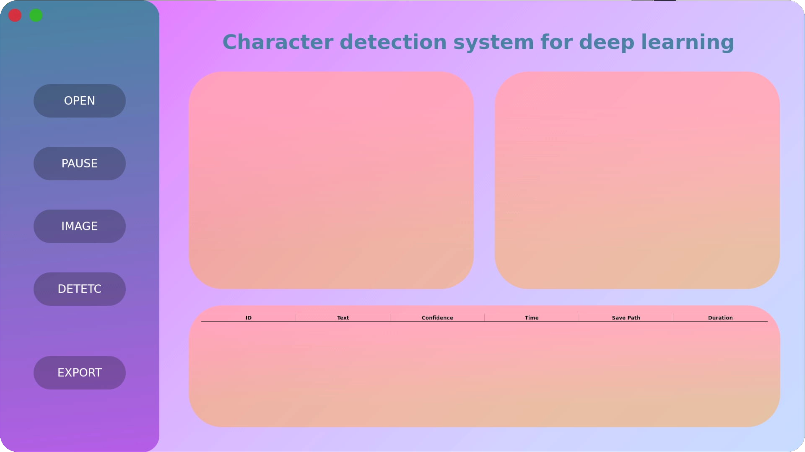

# 香橙派5芯片字符检测
  香橙派5（rk3588）部署yolov8 + easyocr + pyqt5的芯片字符识别系统（Chip character recognition system deploying YOLOv8 + EasyOCR + PyQt5 on Orange Pi 5 (RK3588)）
<!-- PROJECT SHIELDS -->
<p align="center">
  <a href="https://github.com/ABigCyan/Chip-character-recognition">
    
  </a>
  
<!-- PROJECT LOGO -->
  
## 目录

- [环境配置](#环境配置)
  - [电脑主机环境配置](#电脑主机环境配置)
  - [香橙派5环境配置](#香橙派5环境配置)
- [文件目录说明](#文件目录说明)
- [作者](#作者)
- [鸣谢](#鸣谢)

### 环境配置
  分别是x86pc和开发板的环境配置

#### 电脑主机环境配置
1)yolov8环境配置

用mimiconda创建虚拟环境(可以参考这个b站视频非常详尽：【【手把手带你实战Ultralytics】02-环境安装与配置】 https://www.bilibili.com/video/BV1vH4y1a72o/?share_source=copy_web&vd_source=d41740ad2b14d1c71d883e3bad08d3fd）

  pip安装pytorch（pytorch官网：https://pytorch.org/）
  
  ```
pip3 install torch torchvision torchaudio --index-url https://download.pytorch.org/whl/cu118
```

  打开yolov8目录pip进行环境配置
  
```
pip install -e .
```

2)rknn-toolkit配置

电脑安装wsl虚拟机，获取https://github.com/rockchip-linux/rknn-toolkit

3）easyocr环境搭建

使用从github上获取https://github.com/JaidedAI/EasyOCR

打开到目录使用pip进行安装

```
pip install -e .
```

#### 香橙派5环境配置

1）easyocr配置，conda环境配置和rknn-toolkit配置

和pc端一致，pytorch和miniconda注意要进行arm64版本的安装

2）pyqt5配置

pip安装会报错，猜测是无法安装arm版本的pyqt5，换成conda进行安装

```
pip install -i https://pypi.tuna.tsinghua.edu.cn/simple PyQt5
pip install -i https://pypi.tuna.tsinghua.edu.cn/simple PyQt5-tools 
```

由于conda的pyqt5会与pip安装的cv2冲突，可以把cv2从从pip移除，使用conda进行安装

```
pip unstall opencv-python
conda install opencv
```

如果下不动可以考虑换源（https://blog.csdn.net/innovationy/article/details/121510666）


### 文件目录说明
1)yolov8-sea 

数据集来自飞浆公开数据集https://aistudio.baidu.com/datasetdetail/180690，非常感谢省去了很长的时间进行数据集标注，里面数据集质量非常高，我又加上了一下噪声来增强数据集，效果非常显著

过些日子会以网盘链接分享出来

里面runs里有训练完的模型，包含原始模型，加上数据增强和注意力机制的

其中包含pt to onnx和detect的py脚本

2）onnx to rknn

是x86主机进行格式转换的文件，可以参考这篇博客：https://blog.csdn.net/m0_57315535/article/details/128250096

里面包含已经转换好格式的rknn文件

3）orangepi

这个文件夹就是香橙派部署文件(test.py)，ui文件(untitled.py)，和最终整合文件（gui.py）拿来即用，开袋即食


### 鸣谢

- [easyocr](https://github.com/JaidedAI/EasyOCR)
- [yolov8](https://github.com/ultralytics/ultralytics)
- [rknn-toolkit](https://github.com/rockchip-linux/rknn-toolkit)
- [yolo环境搭建](https://www.bilibili.com/video/BV1vH4y1a72o/?share_source=copy_web&vd_source=d41740ad2b14d1c71d883e3bad08d3fd）)
- [飞浆公开数据集](https://aistudio.baidu.com/datasetdetail/180690)


